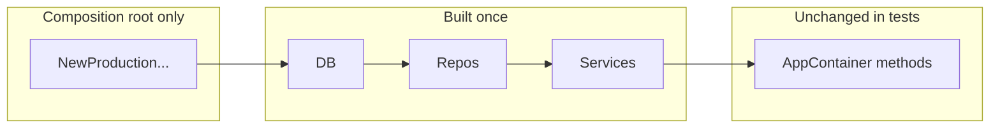

# Dependency injection: FastAPI-like providers in Go

## How this differs from FastAPI

FastAPI resolves `Depends()` per request using introspection and builds a graph at runtime. Go has no equivalent built-in. Common approaches:

- **Composition root (idiomatic Go)** — One place constructs the object graph in dependency order; everything else receives **interfaces** (your `[IdentityContainer](internal/identity/app/container/container.go)`, `[ICredentialRepository](internal/identity/app/modules/auth/repository/credential_repository.go)`, etc.). Nested deps are resolved by constructing leaves first, then parents, in that single place.
- **Explicit provider libraries** — [google/wire](https://github.com/google/wire) (compile-time graph) or [uber/dig](https://github.com/uber-go/dig)/fx (runtime `Provide`), which are the closest to "register a provider function; container figures out args."

Your idea — **stable `Provide`-style methods on the container, only the root constructor changes for tests** — matches the composition-root pattern and is a good fit.

## Recommended shape for your codebase

**1. Keep consumer-facing API as interfaces**

You already pass `[di.Container](pkg/di/container.go)` and cast to `[IdentityContainer](internal/identity/app/container/container.go)` in `[api_router.go](internal/identity/app/modules/auth/api/api_router.go)`. Extend that pattern: handlers and services should depend on **small interfaces** (e.g. `ICredentialRepository`), not `*AppContainer`, where practical.

**2. `AppContainer` holds pre-built deps; methods only return them**

- Production: `[NewAppContainer](internal/identity/app/container/container.go)` loads config, opens DB, calls `NewProviderRepository()`, etc., and stores `**interface` types** on the struct (e.g. `providerRepository repository.IProviderRepository` — not pointer-to-interface).
- Each "provider" is a method like `ProviderRepository() repository.IProviderRepository` that returns the field. Tests never swap these methods — they swap **what was stored** when the container was built.

**3. Two clean ways to avoid duplicating "test `NewAppContainer`" logic**

| Approach                  | Idea                                                                                                                                                                                                                                                                                                                                       |
| ------------------------- | ------------------------------------------------------------------------------------------------------------------------------------------------------------------------------------------------------------------------------------------------------------------------------------------------------------------------------------------ |
| **Deps / options struct** | Define `IdentityDeps` (or use functional options) with `DB`, repos, logger. `NewAppContainer(deps IdentityDeps) *AppContainer` has no I/O. A separate `NewProductionIdentityContainer(ctx, appPrefix, logger)` loads env, opens postgres, fills `IdentityDeps`, and calls `NewAppContainer`. Tests call `NewAppContainer` with mocks only. |
| **Two constructors**      | `NewAppContainer(...)` for prod (current) + `NewAppContainerForTest(deps ...)` that skips DB init. Slightly more duplication unless both call a shared private `newAppContainerCore(deps)`.                                                                                                                                                |

Both preserve your goal: **call sites and accessor methods stay the same**; only the root wiring changes.

**4. Nested dependencies**

There is no magic resolver unless you add Wire/dig. The rule is: **in one function** (production helper or Wire injector), build `A`, then `B(A)`, then `C(B)` — exactly the same order FastAPI would infer, but written explicitly once.

## Optional: closer to FastAPI semantics

If you want **provider functions** that declare dependencies as parameters (like FastAPI):

- **Wire**: you write `func NewX(db *postgres.Connector) X` and Wire generates the initializer. Tests use a different injector set or manual `NewX(mockDB)`.
- **dig**: `c.Provide(NewX)` and dig invokes `NewX` with resolved args. Tests register alternate constructors.

This adds tooling and learning cost; it pays off on large graphs.

## Small note on current code

`[ProviderRepository() *repository.IProviderRepository](internal/identity/app/container/container.go)` returns a **pointer to interface**, which is atypical in Go and easy to misuse; prefer returning `repository.IProviderRepository` and storing the repo as an interface value on the struct.

## Testing story (aligned with your goal)

- **Unit tests** for handlers/services: inject a **mock `IdentityContainer`** or mock repos directly — no real `AppContainer`.
- **Integration / higher-level tests**: `NewAppContainer` (or `NewAppContainer(deps)`) with fake DB or mocked repos via the deps struct.

You do **not** need to reimplement every Provide method for tests if accessors only return constructor-time fields.

## Clarifying question (affects design only if you need it)

Are all dependencies **application-lifetime singletons** (current style: one DB, one repo set for the whole HTTP server), or do you need **per-request** resolution (e.g. request-scoped DB tx, user context)? Per-request scope usually pushes you toward handler middleware passing `context` + scoped structs, or a request-scoped dig child container — not a single global `AppContainer` field per dep.

If your answer is "singletons only," the deps struct + single core constructor is enough and matches what you described.