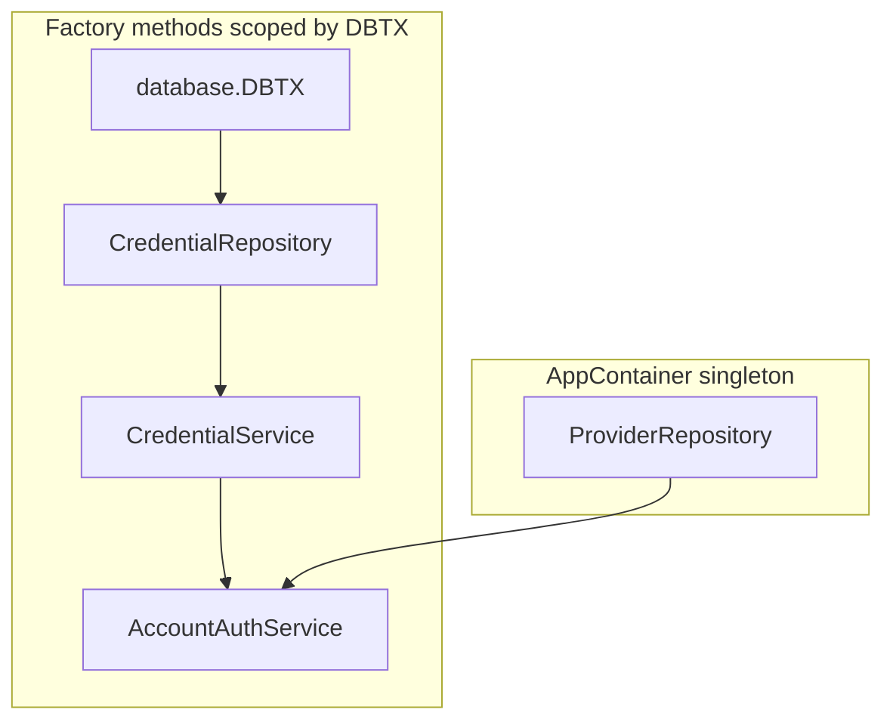

# Dependency injection: FastAPI-like providers in Go (updated)

## Mixed lifetimes (your actual requirement)

- **Singleton (app lifetime):** `[ProviderRepository](internal/identity/app/modules/auth/repository/)` — loaded once in `[NewAppContainer](internal/identity/app/container/container.go)`, **no change** to that pattern.
- **Tx- / exec-scoped:** `[CredentialRepository](internal/identity/app/modules/auth/repository/credential_repository.go)` and upcoming **Account module** services. They must use the **same** `[database.DBTX](pkg/database)` — either the pool/connector for non-transactional work or a **single transaction** when the handler starts `BeginTx` and passes that handle down.

`[ProviderService](internal/identity/app/modules/auth/service/provider_service.go)` already models this: it holds `database.DBTX` + `IProviderRepository`. Reads can use the pool; anything that must be atomic with account/account-credentials uses the **transaction** you pass in.

## “Provider” in Go = explicit factory with a scope argument

FastAPI resolves `Depends()` per request automatically. In Go, the practical equivalent is:

1. **Optional / explicit scope:** The caller passes `db database.DBTX` (pool or tx). No hidden globals for scoped deps.
2. **Container knows the recipe:** Methods on `[AppContainer](internal/identity/app/container/container.go)` (or a small wrapper) **construct** the chain in order. Same function bodies in prod and tests; tests swap only what `[NewAppContainer](internal/identity/app/container/container.go)` wired (singletons) or pass a **mock `DBTX`** / fake tx into the factory.

### Example chain (what you described)




- `**CredentialRepository`:** typically stateless (`NewCredentialRepository()`); factory can return the interface each time, same concrete type, **but every method call uses the `db` you pass into the service/repository method** (your repos already take `ctx, db, …`). The important part is services are constructed with the **same** `DBTX` instance for the whole use-case.
- `**AccountAuthService`:** constructor takes `db` + deps (`CredentialService`, maybe `ProviderService`, etc.). Container factory builds inner services first, then the account service.

## Two equivalent API shapes (pick one style, same semantics)

**A. Methods on `AppContainer`**

```go
func (c *AppContainer) CredentialRepository() repository.ICredentialRepository
func (c *AppContainer) CredentialService(db database.DBTX) *CredentialService
func (c *AppContainer) AccountAuthService(db database.DBTX) *AccountAuthService
```

Note: if `CredentialRepository` is stateless, `CredentialRepository()` needs no `db`; only services that **close over** `db` need it. Repos that don’t hold `db` stay trivial singletons at type level; alignment is “all calls for this request use this `db`.”

**B. Scoped handle (nice when many tx-scoped deps exist)**

```go
type IdentityScope struct {
    c  *AppContainer
    db database.DBTX
}

func (c *AppContainer) Scope(db database.DBTX) IdentityScope

func (s IdentityScope) AccountAuthService() *AccountAuthService {
    // build CredentialService(s.db, ...), then AccountAuthService(s.db, ...)
}
```

Handlers: `tx, _ := connector.BeginTx(...); defer tx.Rollback(); svc := container.Scope(tx).AccountAuthService()`. One place passes `db`; nested chain stays DRY.

## What not to do (unless you really want magic)

- Sticking **tx-only** in `context.Context` with unexported keys works but makes “what this handler needs” implicit and harder to test; **explicit `database.DBTX` in factory args** matches your “optionally pass something” and keeps the container as the composition root.

## Wire / dig

Still optional. Tx-scoped graphs are **small and explicit**; factory methods or `IdentityScope` are usually enough. Wire/dig help when registration grows huge.

## Testing

- **Singletons:** mocked via `NewAppContainer(deps)` or test container that patches `providerRepository`.
- **Scoped chain:** call `AccountAuthService(mockDBTX)` (or `Scope(mockDBTX).…`) with a stub `DBTX` implementation; no second implementation of the factory methods.

## Small note on current `IdentityAuthContainer`

Ensure `ProviderRepository()` returns `repository.IProviderRepository` (interface value), not `*repository.IProviderRepository`, and the struct field is `repository.IProviderRepository`.

## Resolved clarification

You need **both** singleton and **tx-scoped** construction. Provider repository remains singleton; credential path and account auth stack are built **on demand** with a shared `database.DBTX` supplied by the caller (handler or orchestrating service).