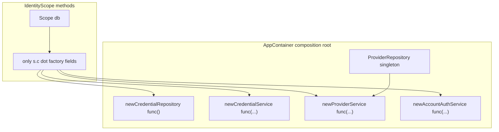

# Dependency injection: Method B with container-only factories

## Rule you asked for

- `**IdentityScope` must not call** `authrepo.New…`, `authsvc.New…`, `accountsvc.New…`, or any package-level constructor.
- `**AppContainer` holds `func` fields** (or a small `IdentityWiring` struct) that *perform* those constructions.
- `**NewAppContainer` (and only that path for prod)** assigns those fields using the real `New`* functions. **Tests** assign the same fields to closures returning mocks.
- `**IdentityScope` implementation stays identical** in prod and test; only the container’s field values differ.

Package-level `New` appears **only** at the composition root (typically inside `NewAppContainer`), not inside `scope.go`.

## Mixed lifetimes (unchanged)

- **Singleton:** `[ProviderRepository](internal/identity/app/modules/auth/repository/)` on `[AppContainer](internal/identity/app/container/container.go)`.
- **Scoped:** `[IdentityScope](internal/identity/app/container/container.go)` carries one `[database.DBTX](pkg/database/ports.go)` (pool or transaction).




---

## `AppContainer` struct (all wiring references)

Illustrative — adjust types to match your modules.

```go
type AppContainer struct {
	logger             common.Logger
	connector          *postgres.ConnectorPostgres
	providerRepository repository.IProviderRepository

	newCredentialRepository func() repository.ICredentialRepository
	newCredentialService    func(db database.DBTX, repo repository.ICredentialRepository) *authsvc.CredentialService
	newProviderService      func(db database.DBTX, repo repository.IProviderRepository) *authsvc.ProviderService
	newAccountAuthService func(
		db database.DBTX,
		cred *authsvc.CredentialService,
		prov *authsvc.ProviderService,
	) *accountsvc.AccountAuthService
}
```

**Production** — `[NewAppContainer](internal/identity/app/container/container.go)` fills these **once**:

```go
return &AppContainer{
	logger:             logger,
	connector:          connector,
	providerRepository: providerRepository,

	newCredentialRepository: func() repository.ICredentialRepository {
		return repository.NewCredentialRepository()
	},
	newCredentialService: func(db database.DBTX, repo repository.ICredentialRepository) *authsvc.CredentialService {
		return authsvc.NewCredentialService(db, repo)
	},
	newProviderService: func(db database.DBTX, repo repository.IProviderRepository) *authsvc.ProviderService {
		return authsvc.NewProviderService(db, repo)
	},
	newAccountAuthService: func(db database.DBTX, cred *authsvc.CredentialService, prov *authsvc.ProviderService) *accountsvc.AccountAuthService {
		return accountsvc.NewAccountAuthService(db, cred, prov)
	},
}, nil
```

Lazy **tx** for account flows: add e.g. `newCredentialServiceForDB func(database.DBTX) *authsvc.CredentialService` on the container (still a field), and inject **that** into `AccountAuthService` instead of a pre-built credential service — same rule: only `NewAppContainer` uses package `New`* inside the closure body.

---

## `IdentityScope` — **only** `s.c.<field>(...)`

```go
type IdentityScope struct {
	c  *AppContainer
	db database.DBTX
}

func (c *AppContainer) Scope(db database.DBTX) IdentityScope {
	return IdentityScope{c: c, db: db}
}

func (s IdentityScope) credentialRepository() repository.ICredentialRepository {
	return s.c.newCredentialRepository()
}

func (s IdentityScope) credentialService() *authsvc.CredentialService {
	return s.c.newCredentialService(s.db, s.credentialRepository())
}

func (s IdentityScope) providerService() *authsvc.ProviderService {
	return s.c.newProviderService(s.db, s.c.ProviderRepository())
}

func (s IdentityScope) AccountAuthService() *accountsvc.AccountAuthService {
	return s.c.newAccountAuthService(s.db, s.credentialService(), s.providerService())
}
```

No `authsvc.New` / `repository.New` here — **only** container fields.

---

## Method A (optional thin wrapper)

Same factories: **never** call `authrepo.New` in the method body.

```go
func (c *AppContainer) AccountAuthService(db database.DBTX) *accountsvc.AccountAuthService {
	return c.Scope(db).AccountAuthService()
}
```

---

## Unit test with mocks **without** changing `IdentityScope`

**Idea:** Build an `AppContainer` (or `NewTestAppContainer`) that sets `**newCredentialRepository`** (and any other field) to return mocks. Call `**c.Scope(fakeDB).AccountAuthService()`** — the **same** scope code path as production.

### Example (table-style)

```go
func TestRegisterViaScope_UsesMockCredentialRepo(t *testing.T) {
	mockRepo := &mocks.CredentialRepository{}
	mockRepo.On("GetCredentialByProvider", mock.Anything, mock.Anything, mock.Anything, mock.Anything).
		Return(nil, database.ErrNotFound)

	fakeDB := &mocks.DBTX{} // or stub with sqlmock-backed tx

	c := &container.AppContainer{
		logger:     testLogger,
		connector:  nil, // or minimal stub if something touches DB()
		providerRepository: &mocks.ProviderRepository{},

		newCredentialRepository: func() repository.ICredentialRepository { return mockRepo },

		newCredentialService: func(db database.DBTX, r repository.ICredentialRepository) *authsvc.CredentialService {
			return authsvc.NewCredentialService(db, r) // real service + mock repo — common pattern
		},
		newProviderService: func(db database.DBTX, r repository.IProviderRepository) *authsvc.ProviderService {
			return authsvc.NewProviderService(db, r)
		},
		newAccountAuthService: func(db database.DBTX, cred *authsvc.CredentialService, prov *authsvc.ProviderService) *accountsvc.AccountAuthService {
			return accountsvc.NewAccountAuthService(db, cred, prov)
		},
	}

	svc := c.Scope(fakeDB).AccountAuthService()
	err := svc.RegisterUsername(context.Background(), /* … */)

	require.NoError(t, err)
	mockRepo.AssertExpectations(t)
}
```

What you **did not** change: `**IdentityScope`** method bodies, or handler code shape — only **how `AppContainer` was constructed**.

### What if you need a **fake service** instead of real `NewCredentialService`?

Replace **one field**:

```go
newCredentialService: func(database.DBTX, repository.ICredentialRepository) *authsvc.CredentialService {
	return &fakeCredentialService{} // implements same methods your AccountAuthService needs
},
```

Still **no** edits to `scope.go`.

### Optional: `NewTestAppContainer(t, opts…)` helper

Centralize defaults for “real” inner wiring and only override the mocks you care about, so tests stay short.

---

## Stateless repo vs `db` (brief)

Each `Scope(db)` gives a different `s.db`. `newCredentialRepository()` returns a **repo instance** (often stateless); **which** `db` is used is whatever you pass into `Scope` and into service methods.

---

## What to avoid

- Calling package `New*` from `**IdentityScope`** — breaks “swap via container only.”
- `**ProviderRepository()`** return type: use `repository.IProviderRepository`, not `*repository.IProviderRepository`.

---

## Resolved

**Factories live on `AppContainer`.** `**IdentityScope` only calls `s.c` fields.** **Unit tests** build a container with **mock-returning func fields**; `**scope.go` unchanged.**