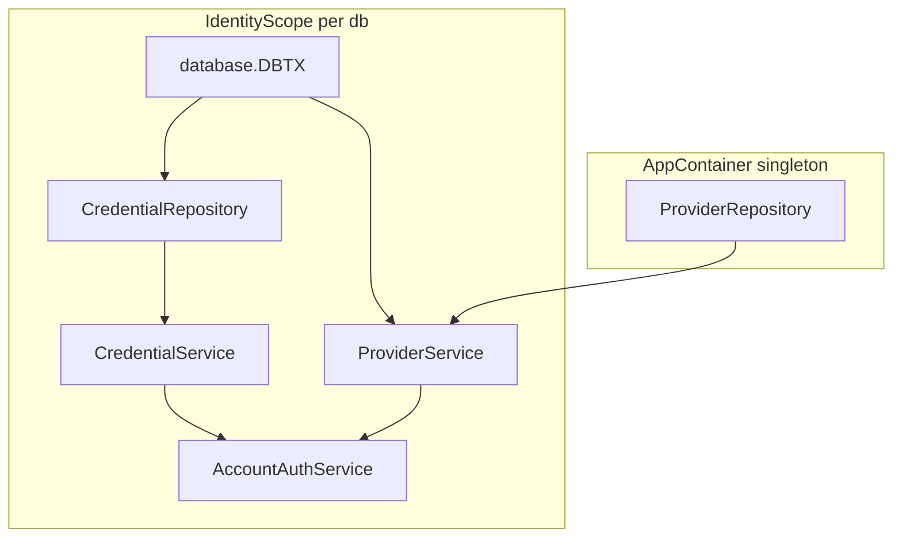

# Dependency injection: FastAPI-like providers in Go (updated)

## Mixed lifetimes (your actual requirement)

- **Singleton (app lifetime):** `[ProviderRepository](internal/identity/app/modules/auth/repository/)` — loaded once in `[NewAppContainer](internal/identity/app/container/container.go)`, **no change** to that pattern.
- **Tx- / exec-scoped:** `[CredentialRepository](internal/identity/app/modules/auth/repository/credential_repository.go)` and upcoming **Account module** services. They share one `[database.DBTX](pkg/database/ports.go)` for the use-case (pool or `[BeginTx](pkg/database/postgres)` transaction).

`[ProviderService](internal/identity/app/modules/auth/service/provider_service.go)` already models "scoped `DBTX` + singleton repo."

## "Provider" in Go = explicit factory; **no Wire, no dig**

Everything is plain Go: structs, constructors, and methods on `[AppContainer](internal/identity/app/container/container.go)` or on a small **scope** type. The scope is just a pair `(container, db)` so you pass `**db` once** and build nested services without repeating arguments.

### Example chain




- **CredentialRepository:** stateless (see below); repo methods receive `(ctx, db, …)` — when called from a scoped service, `**db` is that request’s `s.db`**.
- **AccountAuthService:** built last; gets inner services that all close over the same `s.db` where needed.

### Stateless repo vs per-request `db` (concurrency)

**“Stateless”** here means: the `**CredentialRepository` struct has no fields** (no stored connection). It does **not** mean “all HTTP requests share one `db`.” It only means the repo does not *remember* a connection between calls; every call gets `db` from arguments (ultimately the same `database.DBTX` you put on `IdentityScope` for that use-case).

**Per request / per handler invocation:**

1. Handler A runs: `txA, _ := BeginTx(...); sA := container.Scope(txA); svcA := sA.AccountAuthService()`.
2. Handler B runs: `txB, _ := BeginTx(...); sB := container.Scope(txB); svcB := sB.AccountAuthService()`.

`sA.db` is `**txA`**, `sB.db` is `**txB`**. They are different transactions. Each `svcA` / `svcB` was constructed in that goroutine with **that** scope’s `db`. A million concurrent registers ⇒ a million scopes (small structs), a million txs (or a million logical uses of the pool), **not** one shared tx.

**Singleton pool:** If you use `Scope(connector)` where `connector` is the shared pool, the **object** `connector` is one app-level value, but the pool hands out **different connections** (or serializes safely) per operation — you do not open a million TCP connections; you reuse a bounded pool. For **writes you care about atomically**, you still use `**Scope(tx)`** with one `tx` per request.

**Reusing one `CredentialRepository` instance:** If `NewCredentialRepository()` returns an empty struct with no fields, you *could* share a single global instance — all goroutines can call methods on it safely **as long as** the implementation only uses `ctx`/`db` parameters and no mutable fields. Often people still allocate per scope for clarity; cost is negligible. Either way, **which `db` is used** is determined by **which `Scope(db)` you built**, not by the repo being “stateless.”

---

## Method A vs Method B (same semantics)

**Method A — factories on `AppContainer`:** every top-level service needs `db` in the signature:

```go
func (c *AppContainer) AccountAuthService(db database.DBTX) *accountsvc.AccountAuthService {
    credRepo := authrepo.NewCredentialRepository()
    credSvc := authsvc.NewCredentialService(db, credRepo)
    provSvc := authsvc.NewProviderService(db, c.ProviderRepository())
    return accountsvc.NewAccountAuthService(db, credSvc, provSvc)
}
```

Works fine; when you add more entrypoints you repeat `db` on each method.

**Method B — `IdentityScope`:** you pass `**db` once** when creating the scope; nested providers take `s` only.

---

## Method B: concrete `IdentityScope` pattern (expanded)

### 1. Scope type and constructor

Live next to `AppContainer` (e.g. `[container.go](internal/identity/app/container/container.go)` or `scope.go` in the same package).

```go
package container

import (
	"github.com/koubae/game-hangar/pkg/database"
)

// IdentityScope binds one DBTX (pool or transaction) to the app singletons for a single use-case.
// Handlers: tx, err := c.DB().BeginTx(ctx); defer tx.Rollback(); ...; container.Scope(tx).AccountAuthService().DoSomething(ctx)
type IdentityScope struct {
	c  *AppContainer
	db database.DBTX
}

func (c *AppContainer) Scope(db database.DBTX) IdentityScope {
	return IdentityScope{c: c, db: db}
}

func (s IdentityScope) dbtx() database.DBTX {
	return s.db
}
```

`Scope` is cheap: no allocation beyond the small struct. Same pattern works with the **pool** for read-only flows: `container.Scope(c.DB())` if `ConnectorPostgres` implements `DBTX`.

### 2. Low-level pieces (stateless repo + services that close over `db`)

Illustrative names — align with your real packages.

```go
// Stateless: can return a package-level singleton OR new struct{} each time — same behavior.
func (s IdentityScope) credentialRepository() authrepo.ICredentialRepository {
	return authrepo.NewCredentialRepository()
}

func (s IdentityScope) credentialService() *authsvc.CredentialService {
	return authsvc.NewCredentialService(s.db, s.credentialRepository())
}

func (s IdentityScope) providerService() *authsvc.ProviderService {
	return authsvc.NewProviderService(s.db, s.c.ProviderRepository())
}

// Entry point you call from handlers / orchestration.
func (s IdentityScope) AccountAuthService() *accountsvc.AccountAuthService {
	return accountsvc.NewAccountAuthService(
		s.db,
		s.credentialService(),
		s.providerService(),
	)
}
```

Rules:

- **Singletons** come from `s.c` (`ProviderRepository()`, logger, etc.).
- **Scoped deps** always use `s.db` when constructing services that store `DBTX`.
- **Private** helpers (`credentialRepository`, `credentialService`) keep the public surface small; only expose `AccountAuthService`, `CredentialService`, etc. if other packages need them.

Optional **memoization within one scope** (usually unnecessary if constructors are cheap):

```go
type IdentityScope struct {
	c    *AppContainer
	db   database.DBTX
	cred *authsvc.CredentialService // lazy, optional
}

func (s *IdentityScope) credentialService() *authsvc.CredentialService {
	if s.cred == nil {
		s.cred = authsvc.NewCredentialService(s.db, s.credentialRepository())
	}
	return s.cred
}
```

Note: memoization requires a pointer receiver (`*IdentityScope`) if you mutate the struct. For a value receiver, return a new scope only when you need caching is awkward — **prefer pointer `*IdentityScope` or keep everything allocation-free without cache.** Simplest: value `IdentityScope` + no cache.

### 3. Handler sketch (transactional)

```go
func (h *AuthHandler) Register(w http.ResponseWriter, r *http.Request) {
	ctx := r.Context()
	tx, err := h.container.DB().BeginTx(ctx, pgx.TxOptions{})
	if err != nil {
		// handle
		return
	}
	defer func() { _ = tx.Rollback(ctx) }()

	svc := h.container.Scope(tx).AccountAuthService()
	if err := svc.RegisterUsername(ctx, /* … */); err != nil {
		// handle
		return
	}
	if err := tx.Commit(ctx); err != nil {
		// handle
	}
}
```

Non-transactional path: `svc := h.container.Scope(h.container.DB()).AccountAuthService()` (if your connector is a `DBTX`).

### 4. Testing the chain

```go
mockDB := /* something implementing database.DBTX */
c := newTestContainer(/* mock provider repo, etc. */)

svc := c.Scope(mockDB).AccountAuthService()
err := svc.RegisterUsername(context.Background(), /* … */)
```

You never duplicate factory logic: **same `IdentityScope` methods**, swap `NewAppContainer` / test container and `mockDB`.

---

## Method A + B together

You can expose **both**:

- `func (c *AppContainer) Scope(db database.DBTX) IdentityScope` — preferred for handlers.
- Thin wrappers if you want: `func (c *AppContainer) AccountAuthService(db database.DBTX) *accountsvc.AccountAuthService { return c.Scope(db).AccountAuthService() }`

---

## What to avoid

- **Tx in `context.Context`** only — possible, but explicit `DBTX` + `Scope` keeps dependencies visible and tests simple.

## Small note on `IdentityAuthContainer`

`ProviderRepository()` should return `repository.IProviderRepository`, not `*repository.IProviderRepository`.

## Resolved clarification

Singleton **provider repository**; **credential + account** stack built per `Scope(db)` with hand-rolled Go only — no Wire/dig.