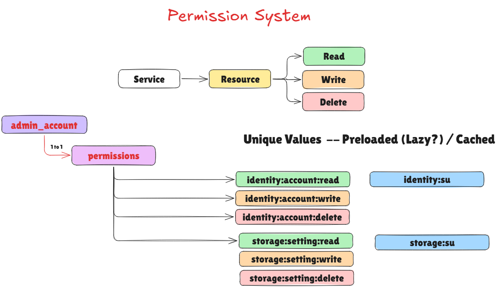
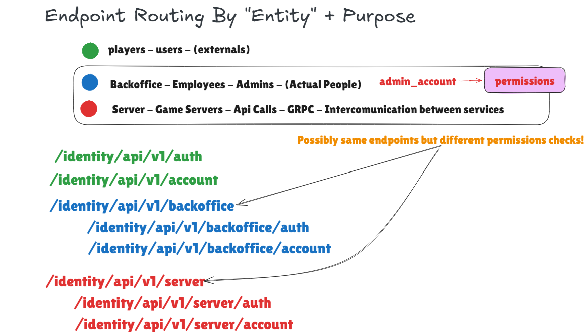

GameHangar -- Identity
======================

TODO. 

Write docs


Architecture
-----------


Auth
----


There are 3 Providers categories


* Managed
* anonymous
* Platform
* Managed


The **managed** + **anonymous** auth providers are all auth methods own
by the company and are the company responsible for handling  
end-to-end authorization.

All the other provider categories are pretty much third parties.

### Permission and scopes systems



Normal users/players are not allowed nor must be able to access these endpoints; reason is because there is an added
`admin_account` database table which is not created during normal player's registration hence is not possible for them
even think of access it.

The `admin_account` has attached a role of `Administrator` which is a special role that is not allowed to be removed.

To access these endpoints, you need:

* A regular `account`
* A regular `account_credentials` (for not with provider type `username`)
* Permissions created in your database `permissions` table,
* A special `admin_account` with attached a list of permissions.
* Request Access token via endpoint `/api/v1/backoffice/auth/login/username`
* The request's body must contain the necessary scope, which is granted only if that `admin_account` currently possesses that scope.

An example curl request:

```bash
curl --location 'http://localhost:10000/api/v1/backoffice/auth/login/username' \
--header 'Content-Type: application/json' \
--data '{
  "source": "global",
  "username": "manager",
  "password": "Q7m!v2Zp#9tX",
  "scope": "identity:account:read"
}'
```

#### Scope & Grants system

The scope system is a way to grant permissions to a user.
Is also a way to "request" a more specific permission than the user has access to.


- `<service>` is the service name,
- `<resource>` is the resource name,
- `<action>` is the action name.

Available actions:

- `read`
- `write`
- `delete`
- `*` -> wildcard action.

The wildcard `*` is used to grant access to all actions, or all resources or all services depending on which part of the 
scope is located.

**Multiple** actions are separated by a comma `,`.
**Multiple** scopes are separated by a pipe `|`.

Format:
```bash
# this is a single scope | MUST CONTAINS ALWAYS THREE PARTS
<service>:<resource>:<action>
<service>:<resource>:<read|write|delete|*>

# this is a single scope with multiple actions
<service>:<resource>:<action>,<action>,<action>

# this is a multiple scopes
<service>:<resource>:<action>|<service>:<resource>:<action>
```

The scope system will merge "duplicate scopes" into a single scope, meaning these two scopes are equal:

```bash
# request 1 scope with multiple actions
identity:account:read,write,delete
# request multiple scope with one action each
identity:account:read|identity:account:write|identity:account:delete
```

If wildcard `*` is used, then is superseded by all actions, resources or services depending on which part of the scope is located.
So if user requests multiple duplicated scope but one contains a wildcard `*` then it removes the others.
```bash
# requested 
identity:account:read,write,delete|identity:account:*
# granted
identity:account:*
```

In the same concept, requesting by wildcard `*` will grant access to all scope's part as long as the user has access to that part.

```bash
# requested 
identity:*:read
# owned
identity:account:read,write,delete|identity:auth:read,write
# granted
identity:account:read|identity:auth:read
```

#### Examples:

```bash
# grant all
*:*:*
# grant all reads 
*:*:read 
# grant all for a service
identity:*:*
# grant all for a service and a resource
identity:account:*

# more fine grained scopes (recommented)
identity:account:read|storage:config:read,write|leaderboard:leaderboard:read|leaderboard:row:read|compaign:campaign:read
```

Examples of requested and owned then granted scopes results:

```bash
# imagine an admin_account owns these scopes
identity:account:read,write|storage:config:read,write|leaderboard:leaderboard:read|leaderboard:row:read|compaign:campaign:read
# when requesting all 
*:*:*
# (granted) => 
identity:account:read,write|storage:config:read,write|leaderboard:leaderboard:read|leaderboard:row:read|compaign:campaign:read

# requesting scope you don't own
identity:account:read|chat:message:read
# (granted) => 
identity:account:read

# requesting any scope you don't own
chat:message:read 
# (granted) =>
... 

```


#### Permissions creation and database table

An example of permissions in DB looks like this:

```bash
+--+--------+--------+------+---------------------------------+
|id|service |resource|action|created                          |
+--+--------+--------+------+---------------------------------+
|1 |*       |*       |*     |2026-04-01 15:38:58.033463 +00:00|
|2 |identity|*       |*     |2026-04-01 15:38:58.033463 +00:00|
|3 |identity|auth    |*     |2026-04-01 15:38:58.033463 +00:00|
|4 |identity|auth    |read  |2026-04-01 15:38:58.033463 +00:00|
|5 |identity|auth    |write |2026-04-01 15:38:58.033463 +00:00|
|6 |identity|auth    |delete|2026-04-01 15:38:58.033463 +00:00|
|7 |identity|account |*     |2026-04-01 15:38:58.033463 +00:00|
|8 |identity|account |read  |2026-04-01 15:38:58.033463 +00:00|
|9 |identity|account |write |2026-04-01 15:38:58.033463 +00:00|
|10|identity|account |delete|2026-04-01 15:38:58.033463 +00:00|
+--+--------+--------+------+---------------------------------+
```

These are created using this SQL command (just to give an idea):

```sql
INSERT INTO permissions (service, resource, action)
VALUES
    -- Superuser
    ( '*', '*', '*'),
    -- ==================== < Identity > ==================== --
    ( 'identity', '*', '*'),
    -- Auth
    ('identity', 'auth', '*'),
    ('identity', 'auth', 'read'),
    ('identity', 'auth', 'write'),
    ('identity', 'auth', 'delete'),
    -- Account
    ('identity', 'account', '*'),
    ('identity', 'account', 'read'),
    ('identity', 'account', 'write'),
    ('identity', 'account', 'delete')
;
```


### Endpoint Routing 

There are 3 different types of endpoint, which are routed differently and have different purposes, policies, 
access and authorizations. 




#### Players - Users - Externals

Example Endpoints:

```bash
/identity/api/v1/auth/register
/identity/api/v1/auth/login
/identity/api/v1/account/me
/identity/api/v1/account/...
```

These are the more "orthodox" endpoints, which are at "root level" of the api endpoint `/api/v1`.
Are meant for normal users, players and external services to interact with the identity service.


#### Backoffice - Administrators - Employees - (Actual People)

Example Endpoints:

```bash
/identity/api/v1/backoffice/auth/register
/identity/api/v1/backoffice/auth/login
/identity/api/v1/backoffice/account/me
/identity/api/v1/backoffice/account/...
```

As you can see, simply prefixing the endpoint with `/backoffice` is enough to make it a backoffice endpoint.

These are meant for the backoffice, employees of your company and whoever is able to access the backoffice.
A more secure and restricted endpoint and are meant for employees and administrators of the company.

For more information read [Permission and scopes systems](#permission-and-scopes-systems)

#### Server - Game Servers – API calls – Internal Services (No People)


```bash
/identity/api/v1/server/auth/register
/identity/api/v1/server/auth/login
/identity/api/v1/server/account/me
/identity/api/v1/server/account/...
```

This is going to be very similar in concept to the backoffice endpoints, but is meant for external services.
For the most part, the endpoint may even do the same (like internally the same exact function is used) but is a 
way to differentiate between the two (easy to monitor and analytics).
