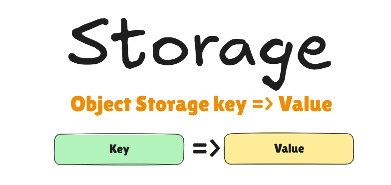
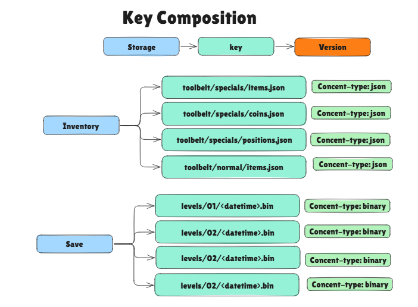
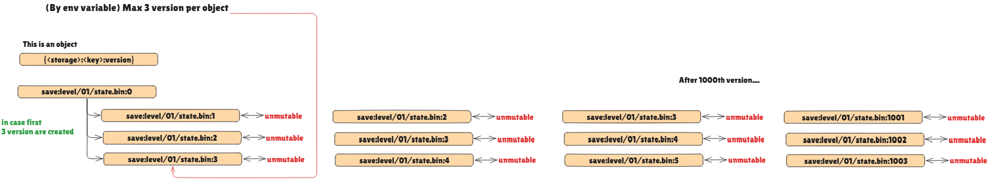
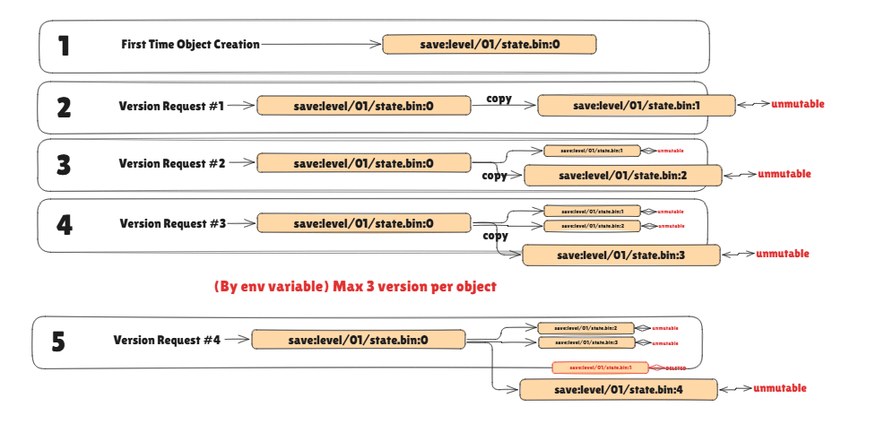
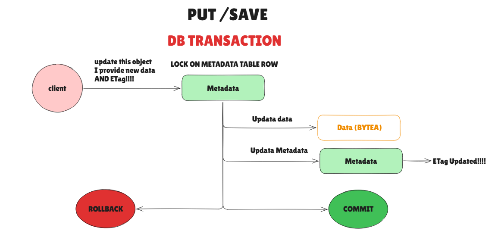

GameHangar -- Storage
======================



**🚧🚧NOTE: Documentation is under construction 🚧🚧**

The GameHangar storage is an Object Storage system.
The main and first implementation is done using PostgresSQL and follows a similar pattern to Amazon S3.
However, it has been developed using an interface and the idea is to possibly switch to another 
implementation backed by actually S3. 

Possibly you can switch to a different implementation by implementing the `Storage` interface and 
use different environment variables to configure it.

The reason is not done using S3 by default is many:

- Avoid it tightly coupled with S3
- Avoid high S3 costs (even a GET Object has its costs)

### Concepts

- Storage: main namespace of objects, think of it as a bucket
- Key: a unique identifier of an object within a bucket, is a path like string 
- Object: The actual data, stored in binary format. You define the content-type.
- ETag: A unique identifier for an object, used to check if the object has changed.
- Atomic operation on Object save. 
- Ownership: Each object has an owner, the owner normally is the player that created it.
- Permissions: Each object has permissions. In this way you can create a private object that belongs to a playern but it may not be able to see it.


#### Path-like system 

This is similar to S3.




#### Key Value object storage reasoning

This is a agnostic storage whereby a key we allow any sort of data to be stored.
At the same time, you can have your own namespace and path-like structure as flat or nested as you'd like.

If you need an inventory sytem, then you create an `inventory` storage and you manage it.
Same with configs or settings. 

If you need Game specific's settings then, you can create a
normal `account` + `admin_account` (to have prililiged access_token with scopes' permissions) and add its own setting there.

#### Versioning

Currently, the version system is limited by Nth about of versions and defined by environment variable of the GameHangar's
Storage service..

The version system is **Explicit** means that you have to create it.
When a new version is requested this is happening:

1. Gets total max amount of version existing.
2. If the number exceeds the limit, then deletes the oldest version.
3. Copies the current version to a new version.





#### Data atomicity



### Endpoints

##### Operations

- Save: Create Or Update by given
- Load: Get Data | Could check for e-tag
- Delete: delete data
- List (By player)
- (Later could list by storage and key all paginated)

#### Save

```bash
PUT api/v1/objects/{storage}/{key}
Headers:
  Content-Type
  If-Match
  If-None-Match
```

#### Load

```bash
GET api/v1/objects/{storage}/{key}
Response:
  Body = data
  Headers:
    Content-Type
    ETag
```

#### Delete

```bash
DELETE /objects/{storage}/{key}
```

#### List

```bash
GET /objects/{storage}?prefix=player/123/
```


##### Error response

**🚧🚧NOTE: Documentation is under construction 🚧🚧**
**NOTE: This are just notes and placeholder for now...**

```json
{
  "error": "conflict",
  "message": "object was modified concurrently, please retry"
}
```

```json
{
  "error": "conflict",
  "message": "object already exists or was created concurrently",
  "retryable": true
}
```

Devs
----


### Database Design

```sql
CREATE SCHEMA storage;

CREATE TABLE storage.metadata (
    id       BIGINT GENERATED BY DEFAULT AS IDENTITY PRIMARY KEY,
    
    storage TEXT NOT NULL,
    key TEXT NOT NULL,
    version INT NOT NULL DEFAULT 0,
    
    account_id UUID NOT NULL,
    permissions TEXT NOT NULL,
    
    content_type TEXT NOT NULL,
    etag TEXT NOT NULL,
    custom_metadata JSONB,
    
    created    TIMESTAMPTZ NOT NULL DEFAULT CURRENT_TIMESTAMP,
    updated    TIMESTAMPTZ NOT NULL DEFAULT CURRENT_TIMESTAMP,
    
    UNIQUE (storage, key, version)
);
-- index to get the latest version of an object
CREATE INDEX index_metadata__latest_version ON storage.metadata (storage, key) WHERE version = 0;
-- index to speed up owner lookups
CREATE INDEX index_metadata__account_id ON storage.metadata (account_id);

CREATE TABLE storage.object (
    metadata_id BIGINT PRIMARY KEY REFERENCES storage.metadata(id) ON DELETE CASCADE,
    data BYTEA NOT NULL,

    created    TIMESTAMPTZ NOT NULL DEFAULT CURRENT_TIMESTAMP,
    updated    TIMESTAMPTZ NOT NULL DEFAULT CURRENT_TIMESTAMP
);
```


#### Transactions & Locking

```sql
BEGIN;

SELECT * FROM objects_metadata
WHERE storage = $1 AND key = $2
FOR UPDATE;

-- check etag condition in app

-- insert or update metadata
-- insert or update data

COMMIT;
```
